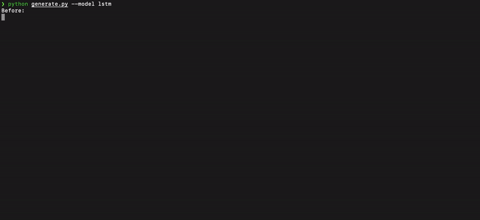
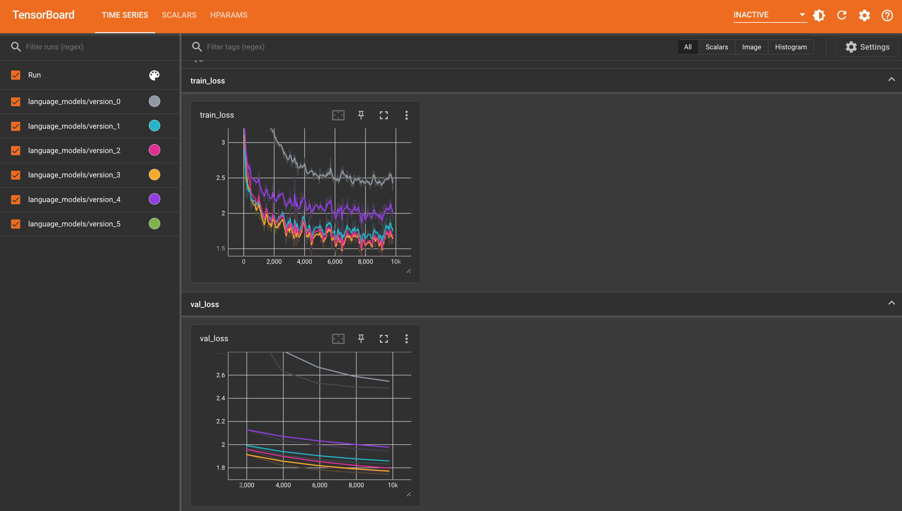

# lightning-language-models

This repository contains custom implementations of various language models in PyTorch Lightning. The major purpose of this project is educational, that is, by abstracting the training and inference logic into standardized base models and scripts, we can put our full focus on the model architecture itself. 

Due to computational constraints, we are restricting ourselves to character-level language models in this repository. However, if you change the tokenization logic in the `train.py` script, you can use any of the models in this repository for word-level language modeling as well.

As training corpus we are using the works of Shakespeare, which can be found in the `data` directory. Feel free to use any other text corpus you like by changing the `corpus` argument in the `train.py` script.

## Models

You can find implementations of the following models in the `models` directory:
- Bigram (`models/bigram.py`)
- Vanilla RNN (`models/rnn.py`)
- LSTM (`models/lstm.py`)
- GRU (`models/gru.py`)
- Transformer (`models/transformer.py`)

Be aware, that these model classes only implement the forward pass of each model, making it easier to understand the different architectures. Shared model logic is inhereted from the base class in `models/base.py`.

## Setup

If you are using conda, run the following commands to create a new environment and install the code dependencies:
```bash
conda create -n lightning_language_models python=3.9
conda activate lightning_language_models
pip install -r requirements.txt
```

## Training

To train a model, run the `train.py` script with the desired model name as argument. For example, to train a LSTM model on a custom dataset, run:
```bash
python train.py --model lstm --corpus data/custom_dataset.txt
```

## Generating Text

To generate text from a trained model, run the `generate.py` script with the desired model name as argument. For example, to generate text from a LSTM model, run:
```bash
python generate.py --model lstm
```



## Tensorboard

If you want to use Tensorboard to monitor your training progress, run the following command in a separate terminal:
```bash
tensorboard --logdir logs
```

Once Tensorboard is running, you can access it by opening the following URL in your browser: http://localhost:6006


